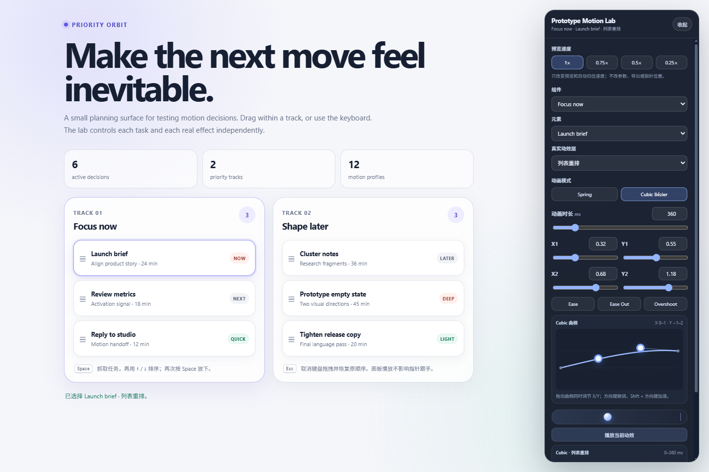
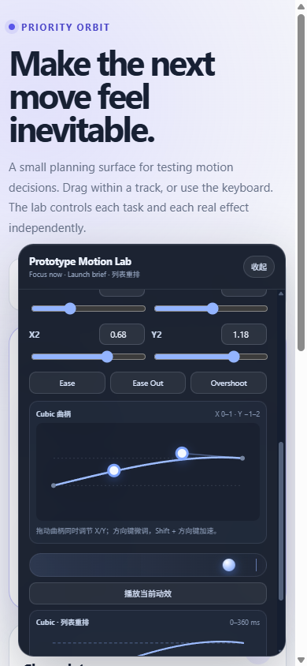
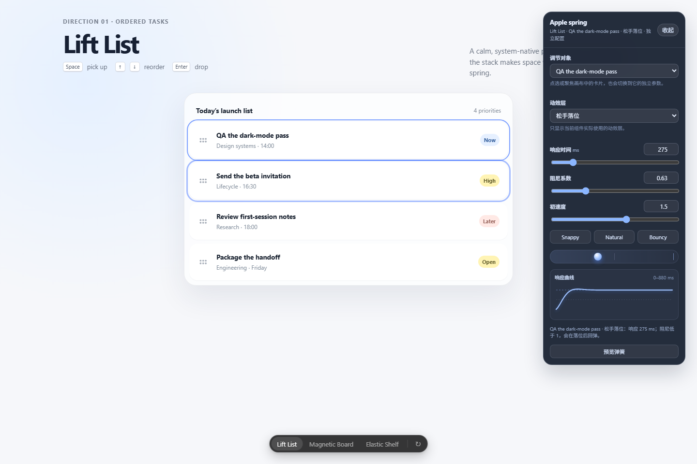
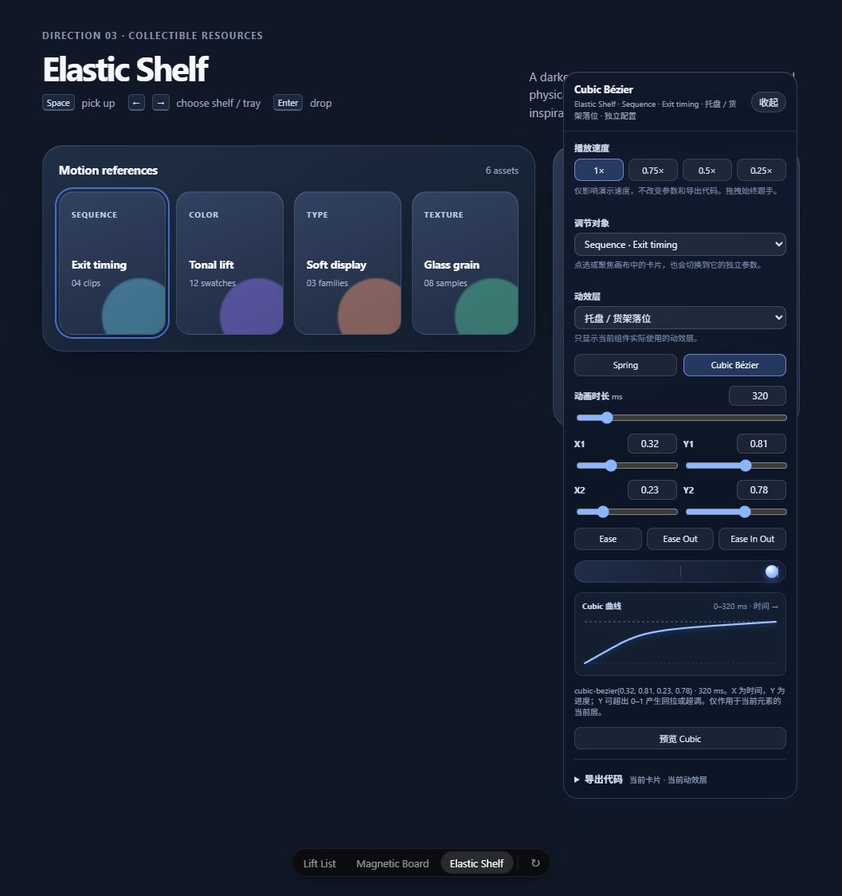

# Prototype Motion Lab

[English](README.md) | [简体中文](README.zh-CN.md)

在真实的交互原型中调节 Spring 与 Cubic Bézier 动效，而不是在脱离界面的缓动曲线工具里猜测效果。



`prototype-motion-lab` 是一个 Codex Skill，用于在原型页面中建立动效控制面板。它为每个真实的 `component / target / effect` 分别保存设置，保持指针拖拽直接跟手，并让当前动效可以独立预览、慢放、检查、持久化和导出。

## 为什么做这个

原型中的动效参数经常被埋在代码里，或先在脱离真实界面的缓动工具中调节，再把同一组数值套用到不同元素上。但列表重排、松手落位和目标切换承担着不同的反馈任务：指针按住内容时必须立即跟手，松手后的自主运动才需要各自的 Spring 或 Cubic 时间曲线。这个 Skill 把调节器直接放进原型，让动效在用户实际看到的布局、内容和交互中被判断与交付。

## 解决了什么问题

| 原有问题 | 动效实验室的解决方式 |
| --- | --- |
| 一条全局曲线会同时改变所有组件 | 按真实的 `componentId / targetId / effectId` 分别保存配置。 |
| 拖拽过程中应用 Spring，元素会落后于指针 | 按住时保持直接跟手，只对列表重排、松手落位等自主运动应用时间曲线。 |
| 抽象参数在正常速度下难以判断 | 同时提供毫秒数值输入、曲线可视化、可拖拽 Cubic 曲柄、实时预览和四档慢速播放。 |
| 固定的检查面板会遮挡正在评估的界面 | 面板支持移动、收起和滚动，并始终限制在视口范围内。 |
| 切换对象或刷新页面会丢失已经调好的参数 | 分别持久化 Spring 与 Cubic 配置，不把它们合并成全局状态。 |
| 动效只能靠截图或含义不清的数值交付 | 针对当前选中的效果导出 Web、Motion for React、SwiftUI 或 Jetpack Compose 代码，并说明原生求解器可能存在的差异。 |

## 功能亮点

- Apple 风格的 Spring 控制，支持以毫秒输入响应时间、阻尼系数和初始速度。
- 每个真实动效都能独立选择 Spring 或 Cubic Bézier，不共用一套全局缓动参数。
- Cubic 控制点支持曲柄拖拽、数字输入、滑杆和键盘微调。
- 提供 `1x`、`0.75x`、`0.5x`、`0.25x` 四档预览速度，不会修改已保存或导出的动画时长。
- 控制面板可以移动、收起，并被限制在视口范围内，尽量不遮挡原型内容。
- 包含设置持久化、减少动态效果、动画中断与取消，以及按当前对象和效果导出代码的指导。
- 提供 Web、Motion for React、SwiftUI 和 Jetpack Compose 的交付代码模式。

## 示例

### Priority Orbit

一个任务规划界面，用于验证 `reflow` 与 `landing` 参数隔离、曲线直接操作、键盘调节、设置持久化和响应式面板行为。

[打开独立运行的 Priority Orbit 示例](examples/priority-orbit-motion-lab.html)




### Drag Spring Variants

Lift List、Magnetic Board 和 Elastic Shelf 三种拖拽方向共用一个动效实验面板，同时保持每个可见对象及其真实动效层的参数彼此独立。

[打开独立运行的 Drag Spring 示例](assets/drag-spring-motion-lab.html)





## 安装

克隆或复制本仓库，将整个目录以 `prototype-motion-lab` 为文件夹名放入 Codex skills 目录：

- Windows：`%USERPROFILE%\.codex\skills\prototype-motion-lab`
- macOS 或 Linux：`~/.codex/skills/prototype-motion-lab`

仓库根目录就是 Skill 根目录，因此 `SKILL.md` 必须保留在顶层。

## 使用

可以直接调用：

```text
使用 $prototype-motion-lab，为这个原型添加动效调节面板。
```

你还可以在提示词中补充目标交互、需要动效的元素、真实效果层、目标导出技术栈，以及这是一次独立探索还是对现有产品界面的改造。

如需了解触发方式，请阅读 [SKILL.md](SKILL.md)；状态、求解器、控制面板、导出和验证要求见[动效实验室契约](references/motion-lab-contract.md)。

## 动效模型

| 范围 | 约定 |
| --- | --- |
| 参数作用域 | 每个真实 `componentId / targetId / effectId` 拥有一份独立、可持久化的配置。 |
| Spring | 使用带有明确单位的 Apple 风格响应参数映射；响应时间不等于动画完全稳定所需的总时长。 |
| Cubic | 先反解 Bézier 的 X，再计算 Y；曲柄和输入字段共同读写同一份配置。 |
| 拖拽 | 被指针按住的内容必须直接跟随指针；时间曲线只应用于自主运动阶段。 |
| 慢速播放 | 只缩放预览或模拟时间，不修改已保存的物理参数和导出时长。 |
| 代码导出 | 只导出当前选中的对象和效果，并明确说明不同原生求解器之间的差异。 |

## 仓库结构

```text
prototype-motion-lab/
├── SKILL.md
├── README.md
├── README.zh-CN.md
├── agents/openai.yaml
├── assets/drag-spring-motion-lab.html
├── examples/priority-orbit-motion-lab.html
├── references/motion-lab-contract.md
├── docs/
│   ├── PUBLISHING.md
│   └── images/
└── tests/validate-package.cjs
```

## 验证

本仓库没有依赖安装或构建步骤。在仓库根目录运行：

```bash
node tests/validate-package.cjs
```

该命令会检查 Skill 入口、元数据、两种语言 README 的链接、截图、内联 JavaScript 语法，以及示例无外部网络运行依赖的边界。

## 适用范围与限制

仓库中的 HTML 文件是独立原型和实现参考，不是生产级动画库。不同框架的导出代码会把同一种动效意图映射到各自的原生能力，但无法保证逐帧完全一致；用于生产环境前，请在目标技术栈中编译并检查实际效果。

## 发布与许可证

发布建议见[发布检查清单](docs/PUBLISHING.md)。本仓库已经公开，但目前没有附带许可证；公开可见本身不代表允许复用代码。仓库所有者应先选择许可证，再将项目作为开源项目对外提供。
